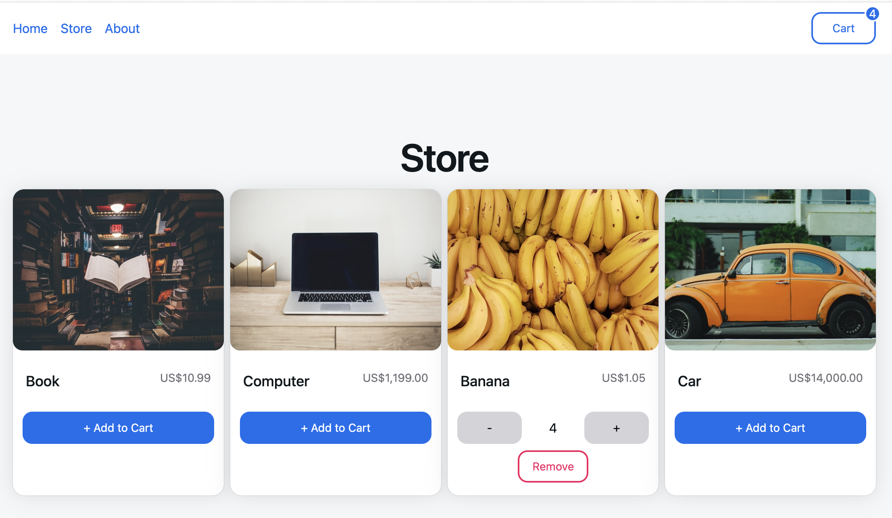

# Shopping cart with HERO UI
Project to learn react in real development application and try using a react library in a real context. 

---

[see project](https://roberrini-shoppingcart-heroui.netlify.app/)

---

In order to do this project with HERO UI I first did a project with bootstrap folling a tutorial from Web Dev Simplified. 
[see sister project](https://github.com/Jeremie-R/ShoppingCart)